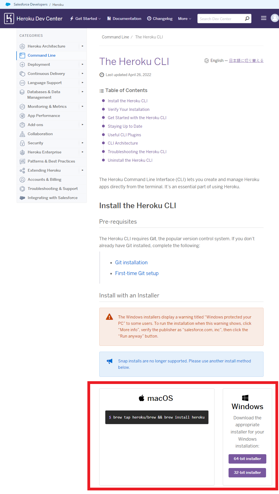
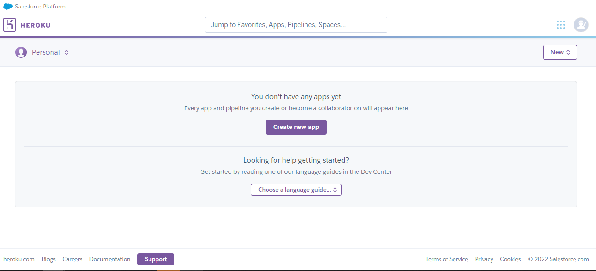
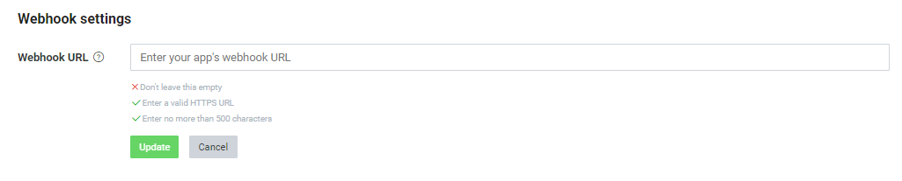

# 快速佈署Line聊天機器人在Heroku平台上教學
## 參考資料
> [從LINE BOT到資料視覺化：賴田捕手系列](https://ithelp.ithome.com.tw/articles/10216620) 

*比較trivial的部分會略過，請自行搜尋關鍵字

首先先去[line開發者平台](https://developers.line.biz/zh-hant/)登入帳號，創建一個provider

Heroku使用git做版本控制，所以我們得去下載[git](https://git-scm.com/book/en/v2/Getting-Started-Installing-Git) ，和下載[ Heroku Command Line Interface (Heroku CLI)](https://devcenter.heroku.com/articles/heroku-cli#download-and-install)來和git進行溝通



再來去[註冊Heroku帳號](https://www.heroku.com/)，註冊完成後登入可以看到以下畫面



接著開啟CMD輸入以下指令，會跑出讓你輸入Heroku帳密的訊息來進行登入
```
heroku login
```
接著創造一個Heroku App(Heroku會確認你的APP名稱是否有人使用)
```
heroku create 你的APP名稱
```
建立成功後可以在這 https://你的APP名稱.herokuapp.com/ 看到Heroku剛幫你創建完的伺服器  

接下來要創建幾個特殊的檔案讓Heroku知道我們所啟用的應用程式類型、需要在什麼環境下，有哪些條件，有哪些附加的套件等等，這幾個檔案分別是`Procfile`、`requirements.txt`、`runtime.txt`:
- Procfile  
告訴 Heroku 我們的應用程式是哪種類型的應用程式，以及需要執行哪個檔案。以我們目前的 LINE 聊天機器人而言，是 web 類型的應用程式，假設我們所執行的檔案是main，那麼我們的Procfile裡面會寫成這樣
```
web: gunicorn main:app –preload
```
**注意:Procfile是一個沒有副檔名的檔案，你可以先用記事本將上面那段文字存成Procfile.txt之後，再把檔案重新命名成Procfile**

- requirements.txt  
告訴 Heroku 需要安裝那些套件。這裡比較有趣的是，我們的電腦本身沒有安裝這些套件也沒關係，Heroku 提供的伺服器才是我們的應用程式真正運行的地方，因此 Heroku 那邊有裝就可以。而我目前的requirements.txt裡面是長這樣的：
```
Flask==2.0.2
gunicorn==20.1.0
line-bot-sdk==2.0.1
```
- runtime.txt  
這個檔案則是告訴 Heroku 我們要用哪種版本的 Python 來執行我們的應用程式。通常來說，沒有也沒關係(所以我就沒有放了XD)，Heroku 聰明的很，會選擇預設的版本，通常是較穩定的版本。  

創建完這些檔案後注意:
所有的這些設定檔，包括Procfile、requirements.txt、以及runtime.txt，必須要同時放在 "Heroku 可以讀到的最外層資料夾" 裡面，而Procfile要讀的 Python 檔案也要放在一起。以下面為例，我都把這四個檔案放在 "test_app" 這個資料夾裡面。而 "test_app" 就是我希望 "Heroku 可以讀到的最外層資料夾"。創建完後可以用`tree /F`檔案結構，看起來會是長這樣:
```
D:\test_app>tree /F
Folder PATH listing
Volume serial number is 6C3E-3C2A
D:.
    Procfile
    requirements.txt
    runtime.txt
    main.py

```
接下來要將檔案傳送到Heroku，我們需要先初始化git，在剛剛的資料夾輸入下方程式碼
```
git init
```
再來告訴 Git 我要推向 Heroku，而且是推向 "你的APP名稱" 那邊：
```
heroku git:remote -a 你的APP名稱
```
最後輸入下列三個步驟就可以成功將我們的資料夾推到Heroku了，之後修改程式要上傳時也是輸入以下指令即可
```
git add .
git commit -m "註解，你這次做了什麼改動"
git push heroku master
```
關於Heroku cli的相關指令我有整理在[這](https://github.com/daoxuewu/my-cs-note/blob/master/note/heroku_CLI.md)有需要可以去看  

### LINE Developers
最後的最後，回到[LINE Developers](https://developers.line.biz/console/)上。進到剛剛創造的 Provider 的 Messaging API 裡。有一個 "Messaging Settings" 的設定區，如下圖，在Webhook settings的欄位下方點擊Edit 後在"Webhook URL"輸入"https://你的APP名稱.herokuapp.com/callback"。按下 "Verify"，如果出現"Success" 那就是成功了。



